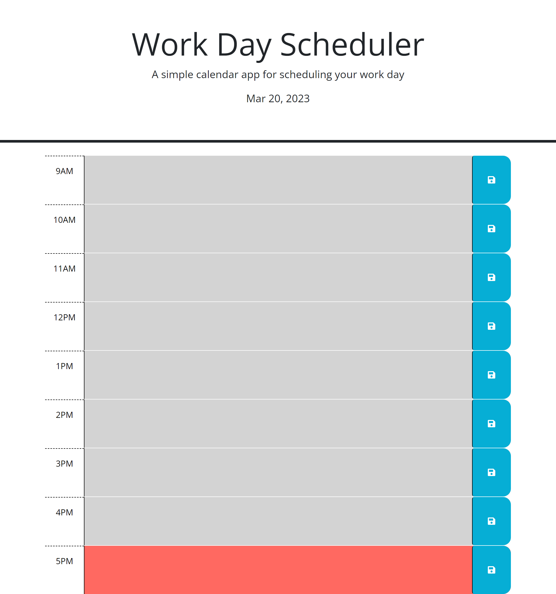

# Work-Day Scheduler

## Description

Work-Day Scheduler is a task-managing web-application. Within the page you may assign tasks within the time slots given.

## Installation

N/A - Access this application through a browser via the link.

Page Link:
https://shaboon.github.io/potential-guacamole/

## Usage

Access the website via GitPages and manage your tasks by writing and saving them to the time-slot

## Credits

Code Provided By:

UNCC-VIRT-FSF-FT-02-2023-U-LOLC-M-F

Peers Collaborated With:

Matthew Lombard
Christopher Snyder\
Sarah Miller\

## License

Default rights reserved under no specific license.

## Features

This page features a 9am - 5pm schedule with managable slots for tasks. Should the user choose to save the information, they will find their tasks back on the page upon their return.

## Tests

N/A
